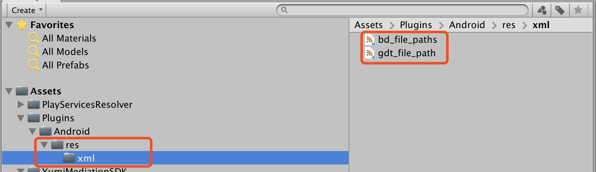

   * [YumiAdSDK for Unity](#yumiadsdk-for-unity)
      * [1 Summary](#1-summary)
      * [2 Download the YumiAdSDK Unity plugin](#2-download-the-yumiadsdk-unity-plugin)
      * [3 Import the YumiAdSDK Unity plugin](#3-import-the-yumiadsdk-unity-plugin)
         * [3.1 First import](#31-first-import)
      * [4 Include the YumiAdSDK](#4-include-the-yumiadsdk)
         * [4.1 Deploy iOS](#41-deploy-ios)
         * [4.2 Deploy Android](#42-deploy-android)
      * [5 Select an ad format](#5-select-an-ad-format)
         * [5.1 Banner](#51-banner)
            * [5.1.1 Initialize Banner](#511-initialize-banner)
            * [5.1.2 Request Banner](#512-request-banner)
            * [5.1.3 Hide Banner](#513-hide-banner)
            * [5.1.4 Show Banner](#514-show-banner)
            * [5.1.5 Destroy Banner](#515-destroy-banner)
            * [5.1.6 YumiBannerViewOptions](#516-yumibannerviewoptions)
         * [5.2 Interstitial](#52-interstitial)
            * [5.2.1 Initialization and Interstitial request](#521-initialization-and-interstitial-request)
            * [5.2.2 Show Interstitial](#522-show-interstitial)
            * [5.2.3 Destroy Interstitial](#523-destroy-interstitial)
         * [5.3 Reward Video](#53-reward-video)
            * [5.3.1 Initialization and Reward Video request](#531-initialization-and-reward-video-request)
            * [5.3.2 Determine if the video is ready](#532-determine-if-the-video-is-ready)
            * [5.3.3 Show Rewarded Video](#533-show-rewarded-video)
         * [5.4 Native Ad](#54-native-ad)
            * [5.4.1 Init Native Ad](#541-init-native-ad)
            * [5.4.2 YumiNativeAdOptions](#542-yuminativeadoptions)
            * [5.4.3 Request Native](#543-request-native)
            * [5.4.4 Create Your Native Ad Layout](#544-create-your-native-ad-layout)
            * [5.4.5 Populating Your Layout Using the Ad's Metadata](#545-populating-your-layout-using-the-ads-metadata)
            * [5.4.6 Show Native Ad View](#546-show-native-ad-view)
            * [5.4.7 Hide Native Ad View](#547-hide-native-ad-view)
            * [5.4.8 Remove Native Ad View](#548-remove-native-ad-view)
            * [5.4.9 Destroy Native Ad View](#549-destroy-native-ad-view)
         * [5.5 Splash](#55-splash)
            * [5.5.1 Import YumiSplashScene](#551-import-yumisplashscene)
            * [5.5.2 Set Ad Placement](#552-set-ad-placement)
            * [5.5.3 Handle Delegate](#553-handle-delegate)
            * [5.5.4 YumiSplashOptions](#554-yumisplashoptions)
            * [5.5.5 Show splash with bottom custom view](#555-show-splash-with-bottom-custom-view)
      * [6 Common issues of developer](#6-common-issues-of-developer)
         * [6.1 TEST ID](#61-test-id)
         * [6.2 Android build failed](#62-android-build-failed)
            * [6.2.1 Failed to find Build Tools...](#621-failed-to-find-build-tools)
            * [6.2.2 No toolchains found...](#622-no-toolchains-found)
            * [6.2.3 Failed to apply plugin...](#623-failed-to-apply-plugin)
            * [6.2.4 Resolving Android Dependencies](#624-resolving-android-dependencies)
            * [6.2.5 the 64K reference limit](#625-the-64k-reference-limit)
            * [6.2.6 Clicking the Android Resolver/Force Resolve option Android dependencies failed](#626-clicking-the-android-resolverforce-resolve-option-android-dependencies-failed)
         * [6.3 Android 9.0 compatibility considerations](#63-android-90-compatibility-considerations)
         * [6.4 targetSdkVersion &gt;= 24 compatibility considerations (Required)](#64-targetsdkversion--24-compatibility-considerations-required)
      * [7 GDPR](#7-gdpr)
         * [7.1 Set GDPR](#71-set-gdpr)
         
# YumiAdSDK for Unity

## 1 Summary

1. To Readers

   This documentation is intended for developers who want to integrate Yumimobi SDK in Unity products.

2. Develop Environment

   - Unity 5.6 and above

   - To deploy to iOS

     Xcode 6.0 or higher

     iOS 8.0 and above

     [CocoaPods](https://guides.cocoapods.org/using/getting-started.html)

   - To deploy to Android

     Android SDK： > 4.1 (API level 16)

     [Demo ](https://github.com/yumimobi/YumiAdSDK-Unity)   

## 2 Download the YumiAdSDK Unity plugin

The YumiAdSDK Unity plugin enables Unity developers to easily serve Yumimobi Ads on Android and iOS apps without having to write Java or Objective-C code. The plugin provides a C# interface for requesting ads that is used by C# scripts in your Unity project. Use the links below to download the Unity package for the plugin or to take a look at its code on GitHub.

[Download the YumiAdSDK Unity plugin](https://github.com/yumimobi/YumiMediationSDK-Unity/raw/master/YumiAdSDKPlugin.unitypackage)

[VIEW SOURCE](https://github.com/yumimobi/YumiAdSDK-Unity)

## 3 Import the YumiAdSDK Unity plugin
### 3.1 First import
Open your project in the Unity editor. Select **Assets> Import Package> Custom Package** and find the YumiAdSDKPlugin.unitypackage file that you downloaded.


Make sure all of the files are selected and click **Import**.


## 4 Include the YumiAdSDK

The YumiAdSDK Unity plugin is distributed with the [Unity Play Services Resolver library](https://github.com/googlesamples/unity-jar-resolver). This library is intended for use by any Unity plugin that requires access to Android specific libraries (e.g., AARs) or iOS CocoaPods. It provides Unity plugins the ability to declare dependencies, which are then automatically resolved and copied into your Unity project.

Follow the steps listed below to ensure your project includes the YumiAdSDK Unity
### 4.1 Deploy iOS 

No procedure are required to integrate the YumiAdSDK into a Unity project.

The YumiAdSDK Ads Unity plugin dependencies are listed in **Assets/YumiMediationSDK/Editor/YumiMobileAdsDependencies.xml**  .
iOS dependencies：

```xml
    <iosPods>
        <iosPod name="YumiAdSDK" version="1.1.1" minTargetSdk="8.0">
            <sources>
                <source>https://github.com/CocoaPods/Specs</source>
            </sources>
        </iosPod>
    </iosPods>
```

Complete the above procedure, Open **xcworkspace** project.

**Note: Use CocoaPods to identify iOS dependencies. CocoaPods runs as a post-build process step.**
**Note: CocoaPods will auto download the YumiAdSDK, you don't need add it by manual.**

### 4.2 Deploy Android 

In the Unity editor, select **Assets> Play Services Resolver> Android Resolver>Force Resolve**. The Unity Play Services Resolver library will copy the declared dependencies into the  **Assets/Plugins/Android** directory of your Unity app.


The YumiAdSDK Ads Unity plugin dependencies are listed in **Assets/YumiMediationSDK/Editor/YumiMobileAdsDependencies.xml**.

Android dependencies:

```xml
<androidPackages>
  <androidPackage spec="com.yumimobi.ads:yumiad:1.1.1" />
  <repositories>
      <repository>https://jcenter.bintray.com/</repository>
  </repositories>
</androidPackages>
```

**Note: Unity plugin will auto add the YumiAdSDK, you don't need add it by manual.**

## 5 Select an ad format

The YumiAdSDK is now included in your Unity app when deploying to either the Android or iOS platform. You're now ready to implement an ad. YumiAdSDK offers a number of different ad formats, so you can choose the one that best fits your user experience needs.

### 5.1 Banner

#### 5.1.1 Initialize Banner

```c#
using YumiMediationSDK.Api;
using YumiMediationSDK.Common;

public class YumiSDKDemo : MonoBehaviour
{
  private YumiBannerView bannerView;

  void Start()
  {
    this.InitBanner();
  }

  private void InitBanner()
  {
    string  gameVersionId = "YOUR_VERSION_ID";
    string  channelId = "YOUR_CHANNEL_ID";

    #if UNITY_ANDROID
      string bannerPlacementId = "YOUR_BANNER_PLACEMENT_ID_ANDROID";
    #elif UNITY_IOS
      string bannerPlacementId = "YOUR_BANNER_PLACEMENT_ID_IOS";
    #else
      string bannerPlacementId = "unexpected_platform";
    #endif

    // You can set the banner size & banner position & autoRefresh & IsSmart in YumiBannerViewOptions
    // This file is described below.
    YumiBannerViewOptions bannerOptions = new YumiBannerViewOptionsBuilder().Build();
    this.bannerView = new YumiBannerView(BannerPlacementId, ChannelId, GameVersionId, bannerOptions);

    /* banner add ad event */
    this.bannerView.OnAdLoaded    += HandleAdLoaded;
    this.bannerView.OnAdFailedToLoad  += HandleAdFailedToLoad;
    this.bannerView.OnAdClick   += HandleAdClicked;
  }

  #region Banner callback handlers

  public void HandleAdLoaded( object sender, EventArgs args )
  {
    Logger.Log( "HandleAdLoaded event received" );
  }

  public void HandleAdFailedToLoad( object sender, YumiAdFailedToLoadEventArgs args )
  {
    Logger.Log( "HandleFailedToReceiveAd event received with message: " + args.Message );
  }

  public void HandleAdClicked( object sender, EventArgs args )
  {
    Logger.Log( "Handle Ad Clicked" );
  }

  #endregion
}
```

#### 5.1.2 Request Banner

```C#
this.bannerView.LoadAd();
```

#### 5.1.3 Hide Banner

```C#
this.bannerView.Hide();
```

#### 5.1.4 Show Banner

```C#
this.bannerView.Show();
```

#### 5.1.5 Destroy Banner

```C#
this.bannerView.Destroy();
```

#### 5.1.6 YumiBannerViewOptions

`YumiBannerViewOptions` is the last parameter to init `YumiBannerView`, you can get it in `YumiBannerViewOptions` file.

- `adPosition`

  Set the position of the banner in the superview.

  default is `BOTTOM`.
  
- `bannerSize`
  
  Set the banner size.

  default:
  - iPhone and iPod Touch ad size. Typically 320x50.
  - Leaderboard size for the iPad. Typically 728x90.

- `isSmart`

  Set the banner to automatically adapter the screen width.

  default is `true`.

- `disableAutoRefresh`

  default is `false`. banner will request next ad automatically.

  if you set it to `true`, then you should call `this.bannerView.LoadAd();` by manual.

The default create `YumiBannerViewOptions` instance code:
```C#
YumiBannerViewOptions bannerOptions = new YumiBannerViewOptionsBuilder().Build();
```

The custom create `YumiBannerViewOptions` instance code:
```C#
YumiBannerViewOptionsBuilder builder = new YumiBannerViewOptionsBuilder();
builder.setAdPosition(YumiAdPosition.TOP);
builder.setSmartState(false);
builder.setDisableAutoRefreshState(true);
builder.setBannerSize(YumiBannerAdSize.YUMI_BANNER_AD_SIZE_320x50);

YumiBannerViewOptions bannerOptions = new YumiBannerViewOptions(builder);
```

### 5.2 Interstitial

#### 5.2.1 Initialization and Interstitial request

The interstitial placement will auto cached.

```C#
using YumiMediationSDK.Api;
using YumiMediationSDK.Common;
public class YumiSDKDemo : MonoBehaviour 
{
  private YumiInterstitialAd interstitialAd;
  void Start() 
  {
    this.RequestInterstitial();
  }
  private void RequestInterstitial() 
  {
    string gameVersionId = "YOUR_VERSION_ID";
    string channelId = "YOUR_CHANNEL_ID";
    #if UNITY_ANDROID
      string interstitialPlacementId = "YOUR_INTERSTITIAL_PLACEMENT_ID_ANDROID";
    #elif UNITY_IOS
      string interstitialPlacementId = "YOUR_INTERSTITIAL_PLACEMENT_ID_IOS";
    # else
      string interstitialPlacementId = "unexpected_platform";
    #endif
    this.interstitialAd = new YumiInterstitialAd(interstitialPlacementId, channelId, gameVersionId);

    // add interstitial event
    this.interstitialAd.OnAdLoaded += HandleInterstitialAdLoaded;
    this.interstitialAd.OnAdFailedToLoad += HandleInterstitialAdFailedToLoad;
    this.interstitialAd.OnAdClicked += HandleInterstitialAdClicked;
    this.interstitialAd.OnAdClosed += HandleInterstitialAdClosed;
    this.interstitialAd.OnAdFailedToShow += HandleInterstitialAdFailedToShow;
    this.interstitialAd.OnAdOpening += HandleInterstitialAdOpened;
    this.interstitialAd.OnAdStartPlaying += HandleInterstitialAdStartPlaying;
  }
  
  #region interstitial callback handlers
  public void HandleInterstitialAdLoaded(object sender, EventArgs args)
  {
      Logger.Log("HandleInterstitialAdLoaded event received");
  }

  public void HandleInterstitialAdFailedToLoad(object sender, YumiAdFailedToLoadEventArgs args)
  {
      Logger.Log("HandleInterstitialAdFailedToLoad event received with message: " + args.Message);
  }

  public void HandleInterstitialAdClicked(object sender, EventArgs args)
  {
      Logger.Log("HandleInterstitialAdClicked Clicked");
  }
  public void HandleInterstitialAdClosed(object sender, EventArgs args)
  {
      Logger.Log("HandleInterstitialAdClosed Ad closed");
  }

  public void HandleInterstitialAdFailedToShow(object sender, YumiAdFailedToShowEventArgs args)
  {
      Logger.Log("HandleInterstitialAdFailedToShow event received with message: " + args.Message);
  }
  public void HandleInterstitialAdOpened(object sender, EventArgs args)
  {
      Logger.Log("HandleInterstitialAdOpened  ad opened ");
  }
  public void HandleInterstitialAdStartPlaying(object sender, EventArgs args)
  {
      Logger.Log("HandleInterstitialAdStartPlaying event StartPlaying ");
  }
  #endregion
}
```

#### 5.2.2 Show Interstitial

It is recommended to call `this.interstitialAd.IsReady()` to determine if the screen is ready.

```C#
if(this.interstitialAd.IsReady())
{
  this.interstitialAd.Show();
}
```

#### 5.2.3 Destroy Interstitial

```c#
this.interstitialAd.Destroy();
```

### 5.3 Reward Video

#### 5.3.1 Initialization and Reward Video request

The reward video placement will auto cached.

```C#
using YumiMediationSDK.Api;
using YumiMediationSDK.Common;
public class YumiSDKDemo : MonoBehaviour 
{
  private YumiRewardVideoAd rewardVideoAd;
  void Start() 
  {
    this.RequestRewardVideo();
  }
  private void RequestRewardVideo() 
  {
    string gameVersionId = "YOUR_VERSION_ID";
    string channelId = "YOUR_CHANNEL_ID";
    #if UNITY_ANDROID
      string rewardVideoPlacementId = "YOUR_REWARDVIDEO_PLACEMENT_ID_ANDROID";
    #elif UNITY_IOS
      string rewardVideoPlacementId = "YOUR_REWARDVIDEO_PLACEMENT_ID_IOS";
    # else
      string rewardVideoPlacementId = "unexpected_platform";
    #endif
    this.rewardVideoAd = YumiRewardVideoAd.Instance;

    this.rewardVideoAd.OnAdOpening += HandleRewardVideoAdOpened;
    this.rewardVideoAd.OnAdStartPlaying += HandleRewardVideoAdStartPlaying;
    this.rewardVideoAd.OnAdRewarded += HandleRewardVideoAdReward;
    this.rewardVideoAd.OnRewardVideoAdClosed += HandleRewardVideoAdClosed;
    this.rewardVideoAd.OnAdLoaded += HandleRewardVideoAdLoaded;
    this.rewardVideoAd.OnAdFailedToLoad += HandleRewardVideoAdFailedToLoad;
    this.rewardVideoAd.OnAdFailedToShow += HandleRewardVideoAdFailedToShow;
    this.rewardVideoAd.OnAdClicked += HandleRewardVideoAdClicked;

    // Initiates the ad request, should only be called once as early as possible.
    this.rewardVideoAd.LoadAd(rewardVideoPlacementId, channelId, gameVersionId);
  }
  
  #region reward video callback handlers
  public void HandleRewardVideoAdOpened(object sender, EventArgs args)
  {
      Logger.Log("HandleRewardVideoAdOpened event opened");
  }

  public void HandleRewardVideoAdStartPlaying(object sender, EventArgs args)
  {
      Logger.Log("HandleRewardVideoAdStartPlaying event start playing ");
  }

  public void HandleRewardVideoAdReward(object sender, EventArgs args)
  {
      Logger.Log("HandleRewardVideoAdReward reward");
  }
  public void HandleRewardVideoAdClosed(object sender, YumiAdCloseEventArgs args)
  {
      Logger.Log("HandleRewardVideoAdClosed Ad closed result is  " + args.IsRewarded);
  }
  public void HandleRewardVideoAdLoaded(object sender, EventArgs args)
  {
      Logger.Log("HandleRewardVideoAdLoaded event received");
  }

  public void HandleRewardVideoAdFailedToLoad(object sender, YumiAdFailedToLoadEventArgs args)
  {
      Logger.Log("HandleRewardVideoAdFailedToLoad event received with message: " + args.Message);
  }

  public void HandleRewardVideoAdFailedToShow(object sender, YumiAdFailedToShowEventArgs args)
  {
      Logger.Log("HandleRewardVideoAdFailedToShow event with message: " + args.Message);
  }
  public void HandleRewardVideoAdClicked(object sender, EventArgs args)
  {
      Logger.Log("HandleRewardVideoAdClicked Clicked");
  }
  #endregion
}
```

#### 5.3.2 Determine if the video is ready

```c#
this.rewardVideoAd.IsReady();
```

#### 5.3.3 Show Rewarded Video

```c#
if(this.rewardVideoAd.IsReady())
{
  this.rewardVideoAd.Play();
}
```

### 5.4 Native Ad

#### 5.4.1 Init Native Ad

```C#
using UnityEngine;
using UnityEngine.UI;
using System;
using System.Collections;
using System.Collections.Generic;
using UnityEngine.SceneManagement;
using YumiMediationSDK.Api;
using YumiMediationSDK.Common;

public class YumiNativeScene : MonoBehaviour
{
    private YumiNativeAd nativeAd;
    private YumiNativeData yumiNativeData;
    // UI elements in scene
    [Header("Text:")]
    public Text title;
    public Text body;
    [Header("Images:")]
    public GameObject mediaView;
    public GameObject iconImage;
    [Header("Buttons:")]
    // This doesn't be a button - it can also be an image
    public Button callToActionButton;

    // ad panel
    public GameObject adPanel;
  
    void Start()
    {
        this.InitNativeAd();
    }
    private void InitNativeAd()
    {
        string gameVersionId = "YOUR_VERSION_ID";
        string channelId = "YOUR_CHANNEL_ID";
        #if UNITY_ANDROID
          string nativePlacementId = "YOUR_NATIVE_PLACEMENT_ID_ANDROID";
        #elif UNITY_IOS
          string nativePlacementId = "YOUR_NATIVE_PLACEMENT_ID_IOS";
        #else
          string nativePlacementId = "unexpected_platform";
        #endif
       // you must set native  express ad view  transform if you want to support native express ad
        NativeAdOptionsBuilder builder = new NativeAdOptionsBuilder();
        builder.setExpressAdViewTransform(adPanel.transform);

        YumiNativeAdOptions options = new YumiNativeAdOptions(builder);
        // YumiNativeAdOptions options = new NativeAdOptionsBuilder().Build(); // only native ad
        nativeAd = new YumiNativeAd(NativePlacementId, ChannelId, GameVersionId, gameObject,options);
        // call back
        nativeAd.OnNativeAdLoaded += HandleNativeAdLoaded;
        nativeAd.OnAdFailedToLoad += HandleNativeAdFailedToLoad;
        nativeAd.OnAdClick += HandleNativeAdClicked;
        /// ------only available in ExpressAdView------
        nativeAd.OnExpressAdRenderSuccess += HandleNativeExpressAdRenderSuccess;
        nativeAd.OnExpressAdRenderFail += HandleNativeExpressAdRenderFail;
        nativeAd.OnExpressAdClickCloseButton += HandleNativeExpressAdClickCloseButton;
    }
    #region native call back handles
    public void HandleNativeAdLoaded(object sender, YumiNativeToLoadEventArgs args)
    {
        Logger.Log("HandleNativeAdLoaded event opened");
        if (nativeAd == null)
        {
            Logger.Log("nativeAd is null");
            return;
        }

        if (args == null || args.nativeData == null || args.nativeData.Count == 0)
        {
            Logger.Log("nativeAd data not found.");
            return;
        }
        // args.nativeData is nativeAd data
      	yumiNativeData = args.nativeData[0];
    }
    public void HandleNativeAdFailedToLoad(object sender, YumiAdFailedToLoadEventArgs args)
    {
        Logger.Log("HandleNativeAdFailedToLoad event received with message: " + args.Message);
    }
    public void HandleNativeAdClicked(object sender, EventArgs args)
    {
        Logger.Log("HandleNativeAdClicked");
    }
     /// ------only available in ExpressAdView------
     public void HandleNativeExpressAdRenderSuccess(object sender , YumiNativeDataEventArgs args)
    {
        Logger.Log("HandleNativeExpressAdRenderSuccess");
    }
    public void HandleNativeExpressAdRenderFail(object sender, YumiAdFailedToRenderEventArgs args)
    {
        Logger.Log("HandleNativeExpressAdRenderFail" + args.Message + "data id is " + args.nativeData.uniqueId);
    }
    public void HandleNativeExpressAdClickCloseButton(object sender, YumiNativeDataEventArgs args)
    {
        Logger.Log("HandleNativeExpressAdClickCloseButton" + args.nativeData.uniqueId);
    }
    #endregion
}
```

#### 5.4.2 YumiNativeAdOptions

`YumiNativeAdOptions` is the last parameter to init the `YumiNativeAd`, you can set the ad style by this.

```C#
// AdOptionViewPosition: TOP_LEFT,TOP_RIGHT,BOTTOM_LEFT,BOTTOM_RIGHT
public AdOptionViewPosition adChoiseViewPosition { get; private set; }
// AdAttribution: AdOptionsPosition、text、textColor、backgroundColor、textSize、hide
public AdAttribution adAttribution { get; private set; }
// TextOptions: textSize，textColor，backgroundColor
public TextOptions titleTextOptions { get; private set; }
public TextOptions descTextOptions { get; private set; }
public TextOptions callToActionTextOptions { get; private set; }
// ScaleType: SCALE_TO_FILL、SCALE_ASPECT_FIT、SCALE_ASPECT_FILL
public ScaleType iconScaleType { get; private set; }
public ScaleType coverImageScaleType { get; private set; }
// native express ad view  transform
public Transform expressAdViewTransform { get; private set; }
```

The default create `YumiNativeAdOptions` instance code:
```C#
YumiNativeAdOptions options = new NativeAdOptionsBuilder().Build();
```
The custom create `YumiNativeAdOptions` instance code:
```C#
 NativeAdOptionsBuilder builder = new NativeAdOptionsBuilder();
 builder.setExpressAdViewTransform(adPanel.transform);

 YumiNativeAdOptions options = new YumiNativeAdOptions(builder);
```
**If you want to support native express ad you must use `builder.setExpressAdViewTransform(adPanel.transform);` to create options objects**


#### 5.4.3 Request Native

```C#
int adCount = 1;// adCount: you can load more than one ad
this.nativeAd.LoadAd(adCount);
```

#### 5.4.4 Create Your Native Ad Layout

```C#
public class YumiNativeScene : MonoBehaviour
  {
    private YumiNativeAd nativeAd;
    // UI elements in scene
    [Header("Text:")]
    public Text title;
    public Text body;
    [Header("Images:")]
    public GameObject mediaView;
    public GameObject iconImage;
    [Header("Buttons:")]
    // This doesn't be a button - it can also be an image
    public Button callToActionButton;
    /// ...
  }
```

Here is how they can be associated with the views in the editor:


#### 5.4.5 Populating Your Layout Using the Ad's Metadata

```C#
public class YumiNativeScene : MonoBehaviour
{
  private YumiNativeAd nativeAd;
  private YumiNativeData yumiNativeData;
  private void RegisterNativeViews()
    {
        Dictionary<NativeElemetType, Transform> elementsDictionary = new Dictionary<NativeElemetType, Transform>();
        elementsDictionary.Add(NativeElemetType.PANEL, adPanel.transform);
        elementsDictionary.Add(NativeElemetType.TITLE, title.transform);
        elementsDictionary.Add(NativeElemetType.DESCRIPTION, body.transform);
        elementsDictionary.Add(NativeElemetType.ICON, iconImage.transform);
        elementsDictionary.Add(NativeElemetType.COVER_IMAGE, mediaView.transform);
        elementsDictionary.Add(NativeElemetType.CALL_TO_ACTION, callToActionButton.transform);
        // This is a method to associate a YumiNativeData with the ad assets gameobject you will use to display the native ads.
        nativeAd.RegisterNativeDataForInteraction(yumiNativeData, elementsDictionary);

    }
}
```

#### 5.4.6 Show Native Ad View
1. Native ad

```C#
// Determines whether nativeAd data is invalidated, if invalidated please reload
if (this.nativeAd.IsAdInvalidated(yumiNativeData))
  {
      Logger.Log("Native Data is invalidated");
      return;
  }
// the ad is native ad
if (!yumiNativeData.isExpressAdView)
  {
    this.nativeAd.ShowView(yumiNativeData);
  }
```
2. Native express ad 
```C#
  // if the ad is native express view please show ad in HandleNativeExpressAdRenderSuccess
  if (yumiNativeData.isExpressAdView)
  {
    // ...
  }
```

**You should check whether the ad has been invalidated before displaying it.**

#### 5.4.7 Hide Native Ad View

```C#
this.nativeAd.HideView(yumiNativeData);// Hide nativeAd data associate view
```

#### 5.4.8 Remove Native Ad View

Remove current native ad view from screen, and disconnect the native data from the view.
If you want to display a new view by this layout, call this function first.

```C#
this.nativeAd.UnregisterView(yumiNativeData);
```

#### 5.4.9 Destroy Native Ad View

```C#
this.nativeAd.Destroy();
```

### 5.5 Splash
#### 5.5.1 Import YumiSplashScene
Fllow the steps as the image showing:


**Recommend:**
Set your app's launchImage as `YumiSplashScene`'s background image.

#### 5.5.2 Set Ad Placement
Set your ad information in the `void Start()` method in the **YumiMediationSDK/Api/YumiSplashScript** file.
```C#
void Start()
    {
      #if UNITY_ANDROID
        SplashPlacementId = "YOUR_SPLASH_PLACEMENT_ID_ANDROID";
      #elif UNITY_IOS
        SplashPlacementId = "YOUR_SPLASH_PLACEMENT_ID_IOS";
      #else
        SplashPlacementId = "unexpected_platform";
      #endif
      GameVersionId = "YOUR_GAME_VERSION";
      ChannelId = "YOUR_CHANNEL_ID";
      // ...
    }
```
#### 5.5.3 Handle Delegate
Show your logic when the splash close or fail to show.
Replace `YOUR_MAIN_SCENE` with your main scene name.
- Set `YOUR_MAIN_SCENE` is your main scene
```C#
    private void InputMainSence()
    {
        SceneManager.LoadScene("YOUR_MAIN_SCENE");
    }
```

#### 5.5.4 YumiSplashOptions
`YumiSplashOptions` is the last parameter to init `YumiSplashAd`, you can get it in `YumiSplashOptions` file.
- `adFetchTime`

  Fetch ad timeout duration , default 3s. 
  Over the deadline, sdk will return the `HandleSplashAdFailToShow` delegate, otherwise will return the `HandleSplashAdSuccssToShow` delegate,and display the splash ad.

- `adOrientation`
  Splash ad orientation. only Admob support this function.

- `adBottomViewHeight`
  The height of the ad bottom view.
  Bottom view's height should not exceed 15% of the screen height.

  Create default instance of `YumiSplashOptions`:
  ```C#
  YumiSplashOptions splashOptions = new YumiSplashOptionsBuilder().Build();
  ```
  Create custom instance of `YumiSplashOptions`:
  ```C#
  YumiSplashOptionsBuilder builder = new YumiSplashOptionsBuilder();
  builder.setAdBottomViewHeight(100);
  builder.setAdFetchTime(3);
  builder.setAdOrientation(YumiSplashOrientation.YUMISPLASHORIENTATION_PORTRAIT);

  YumiSplashOptions splashOptions = new YumiSplashOptions(builder);
  ```

#### 5.5.5 Show splash with bottom custom view
You can set your logo view in bottomView's location.
```C#
/// bottom view's height should not exceed 15% of the screen height.
YumiSplashOptionsBuilder builder = new YumiSplashOptionsBuilder().setAdBottomViewHeight(100);
YumiSplashOptions splashOptions = new YumiSplashOptions(builder);

YumiSplashAd splashAd = new YumiSplashAd(SplashPlacementId, ChannelId, GameVersionId, splashOptions);

// ...

```

## 6 Common issues of developer 

### 6.1 TEST ID
 

| OS      | Formats        | Slot(Placement) ID |
| ------- | -------------- | ------------------ | 
| Android | Banner         | uz852t89           | 
| Android | Interstitial   | 56ubk22h           | 
| Android | Rewarded Video | ew9hyvl4           | 
| Android | Native         | dt62rndy           | 
| Android | Splash         | vv7snvc5           |
| iOS     | Banner         | l6ibkpae           | 
| iOS     | Interstitial   | onkkeg5i           | 
| iOS     | Rewarded Video | 5xmpgti4           | 
| iOS     | Native         | atb3ke1i           |
| iOS     | Splash         | pwmf5r42           |

### 6.2 Android build failed
#### 6.2.1 Failed to find Build Tools...
```
* What went wrong:
A problem occurred configuring root project 'gradleOut'.
> Failed to find Build Tools revision 29.0.0
```
**How to fix**

Remove `buildToolsVersion '**BUILDTOOLS**'` in [mainTemplet](../../Assets/Plugins/Android/mainTemplate.gradle).

#### 6.2.2 No toolchains found...
```
* What went wrong:
A problem occurred configuring root project 'gradleOut'.
> No toolchains found in the NDK toolchains folder for ABI with prefix: mips64el-linux-android
```
**How to fix**

Change the version of gradle plugin in [mainTemplet](../../Assets/Plugins/Android/mainTemplate.gradle), for example, change `classpath 'com.android.tools.build:gradle:3.0.1'` to `classpath 'com.android.tools.build:gradle:3.2.1'`.

#### 6.2.3 Failed to apply plugin...
```
* What went wrong:
A problem occurred evaluating root project 'gradleOut'.
> Failed to apply plugin [id 'com.android.application']
   > Minimum supported Gradle version is 4.6. Current version is 4.2.1. If using the gradle wrapper, try editing the distributionUrl in
```
**How to fix(pick one of the follows)**

1. upgrade gradle version to 4.6
2. degrade gradle plugin to match gradle 4.2.1 version. you can check [Update Gradle](https://developer.android.com/studio/releases/gradle-plugin#updating-gradle) to change the gradle plugin version in [mainTemplet](../../Assets/Plugins/Android/mainTemplate.gradle), for example, change `classpath 'com.android.tools.build:gradle:x.x.x'` to `classpath 'com.android.tools.build:gradle:3.0.0+'`.

#### 6.2.4 Resolving Android Dependencies
It maybe spend some time to resolving android dependencies when clicked Assets -> Play Services Resolver -> Android Resolver -> Resolve / Force Resolve. More androidPackages added and more time will be taken. When resolving conflicts, try not to use the Unity IDE, otherwise the Unity IDE may become stuck.

#### 6.2.5 the 64K reference limit
You can use one of the following solutions to avoid the 64K reference limit:

Solution-A: Modify AndroidManifest.xml and mainTemplate.gradle which located Unity project's Assets/Plugins/Android/, if there are no such files then copy from [AndroidManifest](https://github.com/yumimobi/YumiAdSDK-Unity/blob/master/Assets/Plugins/Android/AndroidManifest.xml) and [mainTemplate](https://github.com/yumimobi/YumiAdSDK-Unity/blob/master/Assets/Plugins/Android/mainTemplate.gradle).

AndroidManifest.xml
```xml
<manifest>
  ...
  <application
      android:name="android.support.multidex.MultiDexApplication"
      ...
      >
      ...
  </application>
  ...
</manifest>
```
mainTemplate.gradle
```groovy
allprojects {
  repositories {
    google()
    jcenter()
    ...
  }
}
dependencies {
  ...
  implementation 'com.android.support:multidex:1.0.3'
  ...
**DEPS**}
```

Solution-B: Export Unity project to Android Studio project, then to [Avoid the 64K limit](https://developer.android.com/studio/build/multidex#avoid).

#### 6.2.6 Clicking the Android Resolver/Force Resolve option Android dependencies failed
Clicking Assets/Play Services Resolver/Android Resolver/Force Resolve option error log：
```
stderr:
Exception in thread "main" java.lang.RuntimeException: Timeout of 120000 reached waiting for exclusive access to file: /.gradle/wrapper/dists/gradle-5.1.1-bin/90y9l8txxfw1s2o6ctiqeruwn/gradle-5.1.1-bin.zip
	at org.gradle.wrapper.ExclusiveFileAccessManager.access(ExclusiveFileAccessManager.java:61)
	at org.gradle.wrapper.Install.createDist(Install.java:48)
	at org.gradle.wrapper.WrapperExecutor.execute(WrapperExecutor.java:128)
	at org.gradle.wrapper.GradleWrapperMain.main(GradleWrapperMain.java:61)
```
Please check if the Assets/Plugin/Android/mainTemplate.gradle file in your Unity project exists. If it does not exist, please add mainTemplate.gradle fil.

Generate the mainTemplate.gradle file using the Unity tool：

<div align="center"></div>


### 6.3 Android 9.0 compatibility considerations
At present, Mintegral platform the Android SDK does not support Android9.0 or above. If the app crashes above Android9.0, you can solve by the ways below.

- Set targaetSDKveriosn to 27 or less

### 6.4 targetSdkVersion >= 24 compatibility considerations (Required)
 when you package the app setting targetSdkVersion >= 24 , in order for the SDK to download and install the App class ads can be support normally, you must follow the steps below for compatibility.
 
 **Step 1: Add this provider tag in the Application tag at AndroidManifest.xml**
  ```xml
  <provider
          android:name="com.baidu.mobads.openad.FileProvider"
          android:authorities="${applicationId}.bd.provider"
          android:exported="false"
          android:grantUriPermissions="true">
          <meta-data
              android:name="android.support.FILE_PROVIDER_PATHS"
              android:resource="@xml/bd_file_paths" />
  </provider>
  <provider
      android:name="android.support.v4.content.FileProvider"
      android:authorities="${applicationId}.fileprovider"
      android:exported="false"
      android:grantUriPermissions="true">
      <meta-data
          android:name="android.support.FILE_PROVIDER_PATHS"
          android:resource="@xml/gdt_file_path" />
  </provider>
  ```
<div style="background-color:rgb(228,244,253);padding:10px;">
<span style="color:rgb(62,113,167);">
<b>Note：</b>If your project does not support the ${applicationId} configuration, you can replace ${applicationId} with your app package name.
</span>
</div>

**Step 2: Add the folder directory shown in the following figure in the Assets/plugin/Android directory, download the bd_file_paths.xml and gdt_file_path file, and add the downloaded xml file to the created xml folder：**

<div align="center"></div>

Download [bd_file_paths.xml](../../Assets/Plugins/Android/res/xml/bd_file_paths.xml)

Download [gdt_file_path.xml](../../Assets/Plugins/Android/res/xml/gdt_file_path.xml)

<div style="background-color:rgb(228,244,253);padding:10px;">
<span style="color:rgb(250,0,0);">
<b>Note：</b> If you do not configure the above, it will affect the advertising revenue.
</span>
</div>

## 7 GDPR
This documentation is provided for compliance with the European Union's General Data Protection Regulation (GDPR). 
If you are collecting consent from your users, you can make use of APIs discussed below to inform YumiAdSDK and some downstream consumers of this information. 
Get more information, please visit our official website.

### 7.1 Set GDPR

```C#
public enum YumiConsentStatus
    {
		/// <summary>
		/// The user has granted consent for personalized ads.
		/// </summary>
		PERSONALIZED,

		/// <summary>
		/// The user has granted consent for non-personalized ads.
		/// </summary>
		NONPERSONALIZED,
		/// <summary>
		///  The user has neither granted nor declined consent for personalized or non-personalized ads.
		/// </summary>
		UNKNOWN

	}
```

```C#
// Your user's consent. In this case, the user has given consent to store and process personal information.
YumiGDPRManager.Instance.UpdateNetworksConsentStatus(YumiConsentStatus.PERSONALIZED);
```
